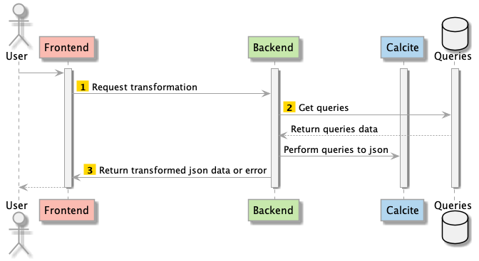
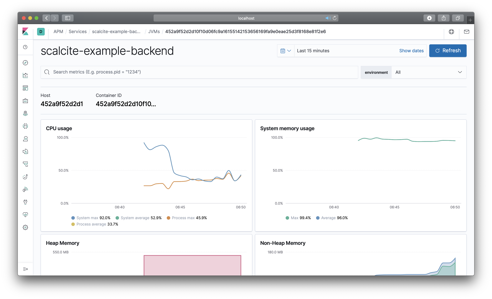

:warning: PLEASE, DO NOT EDIT THIS FILE.
IT IS AUTOGENERATE YOU SHOULD EDIT `modules/scalcite-docs/src/main/mdoc/README.md`
WITH THE COMMAND `sbt scalcite-docs/mdoc`

---

# Scalcite 0.1.1

[](https://www.paypal.com/cgi-bin/webscr?cmd=_donations&business=HE7K7HLJJBVWN&currency_code=EUR&source=url)
[](https://github.com/scala/scala/releases)
[](https://www.oracle.com/technetwork/java/javase/11all-relnotes-5013287.html)
[](https://github.com/sbt/sbt/releases)
[](https://maven-badges.herokuapp.com/maven-central/io.github.mvillafuertem/scalcite_2.12)
[](https://github.com/mvillafuertem/scalcite/actions?query=workflow%3A%22scalaci%22)
[](https://circleci.com/gh/mvillafuertem/scalcite)
[](https://travis-ci.com/mvillafuertem/scalcite)

****

Scalcite is a library to query 💬 and update ✏️ JSON data 📄

This library use https://github.com/apache/calcite

****


## Scalcite Example


### Backend

Is an Akka Microservices using DDD with ZIO ZStreams Tapir

```bash


sbt scalcite-example-backend/run

http://0.0.0.0:8080/api/v1.0/docs


```


### Console

Is an util project to play with json through SQL

```bash

sbt clean compile

./modules/scalcite-example/console/sqlline

!connect jdbc:calcite:model=modules/scalcite-example/console/target/scala-2.13/classes/model.json admin admin

!tables

!describe PERSON

SELECT "favoriteFruit" FROM scalcite;

SELECT "personalinfo.address" FROM scalcite;

```


### Frontend

Is a UI project created with React using Slinky 


## Diagram Sequence 



## Monitoring

